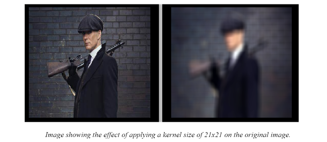

# Advanced Computer Vision Suite

Welcome to the Advanced Computer Vision Suite, a powerful tool designed by PyQt to simplify image processing and computer vision tasks through an intuitive and user-friendly interface. This application provides a wide array of features for manipulating and analyzing images, making it suitable for users with varying levels of expertise, from beginners to advanced users.

## Application Overview
Here is a visualization of how does our application look like:


## Setup and Installation

- Prerequisites:

  - Python 3.6 or higher installed
  - Git installed

- Clone the repository:

  ```
  git clone <repo_url>
  ```

  This will create a local copy of the repository on your machine. Replace the `<repo_url>` with the url of this github repository

- Navigate to the project directory:

  ```
  cd directory
  ```

  Change to the directory where the repository was cloned.

- Install the required dependencies:

  ```
  pip install -r requirements.txt
  ```

  This will install all the necessary dependencies for the application.

- Run the application:
  ```
  python main.py
  ```
  This will start the desktop app.

## Usage

To use the Computer Vision Application, follow these steps:

1. **Choose a Tab**: Select a tab corresponding to the desired image processing operation from the available options in the application's menu or toolbar.

2. **Load an Image**: Import an image into the selected tab from your local file system.

3. **Adjust Parameters**: Depending on the selected operation, adjust the parameters to customize the processing according to your requirements.

4. **Apply Processing**: Click the "Apply" button to apply the chosen processing operation to the loaded image.

5. **View Results**: Visualize the results of the processing operation in real-time within the application's interface.

6. **Export**: Save the processed image to your local file system.

7. **Explore Additional Features**: Experiment with different operations and parameters by navigating through different tabs to explore the full functionality of the application.


## Key Features

The application offers a user-friendly straightforward and intuitive interface, allowing users to perform image processing tasks efficiently without requiring extensive technical knowledge. It also offers a comprehensive functionality With support for a wide range of operations including the following:

### 1. Adding Noise (Uniform, Gaussian, Salt & Pepper)

This feature in the advanced computer vision suite allows users to simulate different types of noise commonly found in digital images:

- **Uniform Noise:** Uniform noise adds random values uniformly distributed across the image intensity range, creating a grainy or speckled pattern. It can simulate various types of interference or imperfections in the image.

  
  
- **Gaussian Noise:** Gaussian noise introduces variations in pixel intensity following a normal distribution, mimicking natural brightness variations and electronic interference. It's useful for modeling sensor noise or atmospheric disturbances.

  
  
- **Salt & Pepper Noise:** Salt and pepper noise inserts random occurrences of extremely bright and dark pixels, resembling errors in image acquisition or transmission. This type of noise can be caused by faulty sensors or data corruption during transmission.

  


### 2. Filtering Noisy Images (Average, Gaussian, Median)

It includes three commonly used filters to effectively reduce noise in digital images:

- **Average Filter:** This filter computes the average intensity of neighboring pixels within a defined window and replaces the central pixel's value with this average. It effectively reduces high-frequency noise but may blur edges and fine details.

  
  
- **Gaussian Filter:** The Gaussian filter applies a weighted average to neighboring pixels, with weights determined by a Gaussian distribution. This filter reduces noise while preserving edges better than the average filter.

  
  
- **Median Filter:** The median filter replaces each pixel's value with the median intensity value of neighboring pixels within a defined window. It is particularly effective at removing salt-and-pepper noise while preserving image details and edges. 


### 3. Detecting Edges using various Masks (Sobel, Roberts, Prewitt)

This feature identifies edges within digital images using different edge detection masks. This feature includes the following masks:

- **Sobel Mask:** The Sobel operator applies a pair of 3x3 convolution kernels to calculate the gradient approximation of the image intensity in the horizontal and vertical directions separately. It highlights edges by emphasizing intensity changes, making it particularly effective for detecting edges with significant gradients.
  
  
  
- **Roberts Mask:** The Roberts cross-gradient operator consists of two 2x2 convolution kernels applied separately to compute the gradient approximation along the diagonal directions. It provides a simple and computationally efficient method for edge detection, effectively highlighting diagonal edges.
  
  
  
- **Prewitt Mask:** The Prewitt operator applies a pair of 3x3 convolution kernels, similar to the Sobel operator, to estimate the image gradient in the horizontal and vertical directions. It detects edges by emphasizing intensity changes in both directions simultaneously, offering robust edge detection performance. 

  


### 4. Frequency Domain Filters (High-pass and Low-pass)

Ability to perform high-pass and low-pass filtering on images in the frequency domain. These filters manipulate the frequency components of images, enabling users to enhance or suppress specific spatial frequency information.

- **High-pass Filters:** High-pass filters attenuate low-frequency components while preserving or enhancing high-frequency details in images. They are useful for edge detection, sharpening, and noise reduction by emphasizing fine image structures.
  
  

- **Low-pass Filters:** Low-pass filters suppress high-frequency components while preserving or enhancing low-frequency information in images. They are effective for smoothing, noise reduction, and blurring by averaging or attenuating high-frequency details.
  
  

### 5. Equalizing and Normalizing Images


Ability to adjust the intensity distribution of digital images, enhancing their visual quality and improving algorithm performance. This feature includes two primary operations:

- **Equalization:** Image Equalization is a histogram-based technique that aims to
adjust the contrast of an image by redistributing pixel intensities.

  

- **Normalization:** Image Normalization is the process of adjusting the pixel values of an image to conform to a predefined scale or range.

  

### 6. Color to Gray-scale transformation. Histograms and distribution functions visualization

This feature converts color images to grayscale and generates histograms for each RGB channel (colored image) OR for the pixels' intensities (gray image). This allows users to visualize the distribution of pixel intensities in a single channel OR in individual color channels, aiding in image analysis and processing.

#### GS Analysis:


#### RGB Analysis:


### 7. Generating Hybrid Images

Hybrid images combine a low-frequency component, derived from a blurred version of one image, and a high-frequency component, obtained by subtracting the low-frequency component. By blending these components, hybrid images create captivating visual illusions, appearing as one image from a distance and transforming into another up close.

#### Hybrid Image 1: Dog (Low-frequency) & Murphy (High-frequency)


#### Hybrid Image 2: Dog (High-frequency) & Murphy (Low-frequency)


  
### 8. Canny Edge Detection

Canny Edge Detection stands as one of the most widely used and highly regarded algorithms in the realm of computer vision for detecting edges in images. Named after its creator, John F. Canny, this technique is renowned for its ability to accurately identify edges while minimizing noise and false detections.

Here are some experiments results produced by our software:


### 9. Hough Detection

Hough Detection, also known as the Hough Transform, is a powerful technique in computer vision used primarily for detecting geometric shapes within images, notably lines and curves.

Here are some experiments using different transformations:


### 10. Active Contour

Active contour technique, or snakes, is like a digital detective for images. It does segmentation by finding object edges by adjusting a contour to hug them snugly. Forces pull the contour toward edges while keeping it smooth. We can give hints to guide the contour. It's like solving a puzzle of object edges, making images easier for computers to understand.

Before showing the results, it might be useful if we discussed the controlled parameters used in the active contour technique:

1. Alpha: Weight of the internal energy term related to the contour smoothness or curvature.
2. Beta: Weight of the internal energy term related to the contour's elasticity or flexibility.
3. max_num_iter: Maximum number of iterations allowed for the contour optimization process.


### 11. Harris Cornerness & Lambda Minus:

Users can explore and compare the performance of Harris Cornerness and Lambda Minus methods in enhancing SIFT-based object descriptor extraction.

Here are some experiments results produced by our software:


### 12. SIFT Features:

The application utilizes the SIFT algorithm to extract robust and distinctive descriptors from objects in images.

Here are some experiments results produced by our software:


### 13. Feature Matching:

Users can perform feature matching between two different images, enabling the evaluation of the effectiveness of each approach in object matching tasks.

Here are some experiments results produced by our software:


### 14. Thresholding (Gray-scaled Images)

- **Optimal Thresholding:**
 Optimal thresholding is a method for segmenting grayscale images by determining the optimal threshold value that maximizes the separation between object and background pixels.
 
 Here are some experiments results produced by our software after applying optimal local thresholding:
 


- **Otsu Thresholding:**
 Otsu's method is a popular thresholding technique that automatically finds the optimal threshold value by minimizing the intra-class variance of the pixels in the image.

Here are some experiments results produced by our software after applying otsu global thresholding:


 - **Spectral Thresholding:**
 Spectral thresholding involves segmenting grayscale images based on spectral properties, which can be particularly useful in scenarios where traditional intensity-based methods may not suffice.
 
 Here are some experiments results produced by our software after applying multi-level local thresholding:
 


### 15. Segmentation (Colored Images)

 - **K-means:** K-means clustering is an unsupervised learning algorithm used for image segmentation. It partitions the image into clusters based on pixel similarity, with each cluster represented by its centroid.
   
  Here are some experiments results produced by our software after applying k-means algorithm:
   


 - **Region Growing:** Region growing is a segmentation technique where pixels are grouped together based on certain criteria, such as similarity in intensity or texture, to form coherent regions.
   
Here are some experiments results produced by our software after applying region growing algorithm:


   
 - **Agglomerative Hierarchical Clustering:** Agglomerative clustering is a bottom-up hierarchical clustering method where each pixel starts as its own cluster and then iteratively merges with its nearest neighbor based on a chosen similarity measure.
   
  Here are some experiments results produced by our software after applying agglomerative algorithm:
   


   
 - **Mean Shift:** Mean shift clustering is a non-parametric clustering algorithm that assigns each pixel to the nearest mode of the probability density function in the feature space, thereby clustering similar pixels together.

Here are some experiments results produced by our software after applying mean shift algorithm:
      


## Conclusion

The Advanced Image Processing Suite provides a powerful and user-friendly solution for a wide range of image processing and analysis tasks. Whether you're a beginner or an advanced user, this application offers comprehensive functionality to meet your needs. Start exploring and enhancing your images with ease and efficiency!


## Contributors

Gratitude goes out to all team members for their valuable contributions to this project.

<div align="left">
    <a href="https://github.com/AhmeddEmad7">
    
  </a>
 <a href="https://github.com/hazemzakariasaad">
      
    </a>
    <a href="https://github.com/omarmohhameed29">
      
    </a>
    <a href="https://github.com/amirhesham65">
      
    </a>
      <a href="https://github.com/Omartarek78">
      
    </a>
</div>
